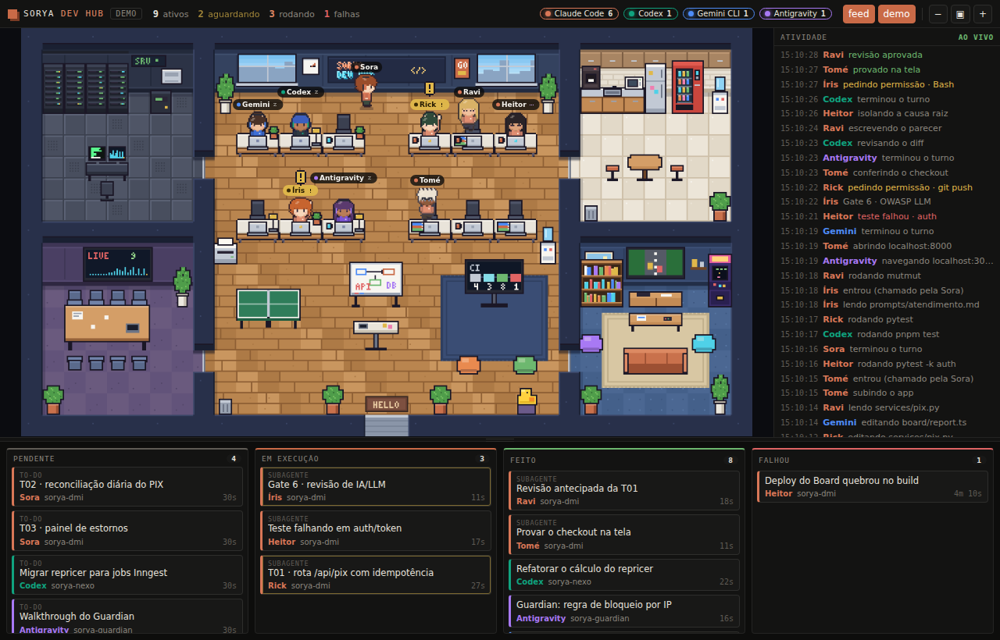
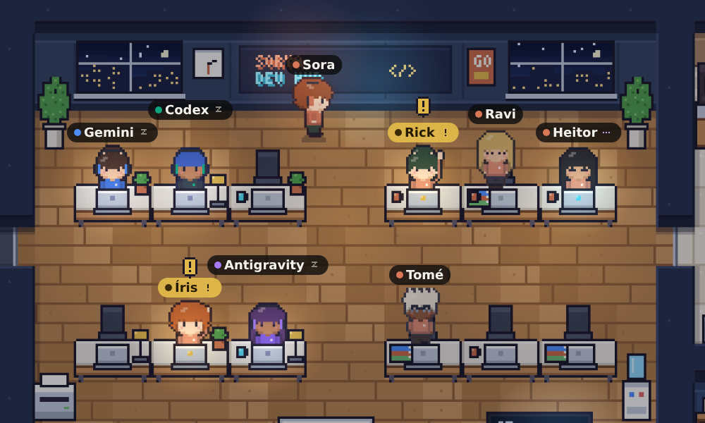

# Agent Office — Sorya Dev Hub

Extensão para VS Code, Antigravity e Cursor que mostra, em pixel art, **cada agente de IA trabalhando na própria mesa** de um dev hub: Claude Code, Codex, Gemini CLI, Antigravity (e Cursor, Copilot, Windsurf via hooks). Embaixo, um **kanban** em tempo real (Pendente · Em execução · Feito · Falhou) e, ao lado, o **feed** de tudo o que está sendo feito.



- Cada agente tem **nome em cima da cabeça** (Sora, Rick, Íris…), lido das fichas dos seus agentes.
- Entra pela porta, senta na mesa, digita, lê, roda comando. **Levanta a mão com "!"** quando precisa de você. Vai tomar café quando fica ocioso e acena e sai quando termina.
- O notebook acende na cor do estado. A plaquinha mostra um ícone do que ele está fazendo (lendo, escrevendo, rodando, pesquisando…).
- As janelas seguem a hora real (dia, pôr do sol, noite com a cidade acesa) e o relógio da parede é de verdade. A TV da sala de reunião e o painel de CI mostram números ao vivo.
- Abre também **no navegador**, em `http://127.0.0.1:4517/office`: bom para tela cheia, segundo monitor ou gravar a tela.
- **Escritório inteiro ou projeto local**: por padrão você vê todos os projetos da máquina ao mesmo tempo. Um clique filtra só quem trabalha na pasta aberta na janela.



## Monitoramento: sem configurar nada

O escritório **não lê o terminal**. Ele lê os **registros locais estruturados** que cada ferramenta já grava. Por isso funciona igual no terminal, no painel da extensão do Claude Code, no Codex da IDE, no app desktop ou no Antigravity: basta a ferramenta rodar nesta máquina.

| Fonte | O que é lido | Cobre |
|---|---|---|
| **Claude Code** | `~/.claude/projects/**/*.jsonl` (+ `subagents/`), `~/.claude/sessions/*.json` | terminal, extensão VS Code/Antigravity/Cursor, app desktop; subagentes; todos |
| **Codex** | `~/.codex/sessions/AAAA/MM/DD/rollout-*.jsonl` | CLI, `codex exec`, extensão da IDE, app desktop; subagentes; `update_plan` |
| **Gemini CLI** | `~/.gemini/tmp/*/chats/session-*.jsonl` (e o `.json` antigo) | sessões e subagentes; `write_todos` |
| **Antigravity** | `~/.gemini/antigravity*/brain/*/task.md`, `transcript.jsonl`, atividade das conversas | checklist `[ ]` `[/]` `[x]` vira tarefas; presença do agente *(best effort: formato fechado)* |

Respeita `CLAUDE_CONFIG_DIR` e `CODEX_HOME`. Cada janela aberta mostra o mesmo escritório.

### Opcional: hooks para precisão ao vivo

Nenhum registro grava o momento em que um agente **pede sua aprovação**. Sem hooks, o escritório infere isso: uma ferramenta que costuma pedir permissão ficou parada, e aí aparece "aguardando aprovação?". Com hooks, o aviso é exato e instantâneo.

`Agent Office: Instalar hooks (precisão ao vivo)` oferece:

| Ferramenta | Como | Arquivo |
|---|---|---|
| Claude Code | hook **HTTP** (sem dependências) | `~/.claude/settings.json` |
| Codex | hook `command` assíncrono | `~/.codex/hooks.json` *(o Codex pede para revisar em `/hooks`)* |
| Gemini CLI | hook `command` | `~/.gemini/settings.json` |
| Cursor | hook `command` | `~/.cursor/hooks.json` |
| Copilot (agente do VS Code) | hook `command` | `~/.copilot/hooks/agent-office.json` |

Como funciona:
- A instalação faz **backup** (`.agent-office.bak`) e só mexe nas entradas marcadas como do Agent Office. `Remover hooks` desfaz.
- Os hooks `command` chamam `~/.agent-office/hook.js`, que precisa de `node` no PATH. O script repassa o evento a **todas as janelas** abertas e sempre sai em menos de 1,5 s com código 0: nunca bloqueia o trabalho.
- Quem prefere plugin do Claude Code pode usar este repositório: tem `.claude-plugin/` e `hooks/hooks.json` com hooks `async`.

## Nomes dos agentes

Times com personas descrevem cada agente numa ficha `.md`:

```markdown
---
name: rick-construtor
description: Rick — rick-construtor (antes sorya-fullstack-builder). Constrói features fullstack…
---
```

- O escritório lê `~/.claude/agents/`, `.claude/agents/` e `.agents/` do workspace, mais as pastas extras de `agentOffice.agentDirs`.
- Da descrição sai a persona: `rick-construtor` vira **Rick**, e o slug antigo `sorya-fullstack-builder` também.
- A ficha que se declara **"sessão principal"** (ex.: Sora, a orquestradora) dá nome às sessões do Claude Code.
- Sem ficha, usa o primeiro pedaço do slug: `heitor-debug` vira **Heitor**.
- Para forçar um nome, use `agentOffice.names`:

```json
"agentOffice.names": { "claude": "Sora", "codex": "Atlas", "tome-qa": "Tomé" }
```

## Instalar

1. Baixe o `agent-office-vX.Y.Z.vsix` em **Assets** na [última Release](https://github.com/crisrebonatto/sorya-pixel-office/releases/latest).
2. Instale de um destes jeitos:
   - **Pela interface** (VS Code, Antigravity ou Cursor): **Extensions** → `…` → **Install from VSIX…** → escolha o arquivo baixado.
   - **Pelo terminal**, passando o caminho do arquivo (o comando procura na pasta atual):
     ```powershell
     code --install-extension "$env:USERPROFILE\Downloads\agent-office-v0.3.0.vsix"
     ```
     No Antigravity e no Cursor, troque `code` por `antigravity` ou `cursor`.
3. Recarregue a janela. A extensão aparece em **Extensions → Installed** e o ícone de prédio surge na Activity Bar.

## Usar

1. Instale a extensão (ou abra esta pasta no VS Code e pressione **F5**).
2. Clique no ícone de prédio na Activity Bar, ou rode **`Agent Office: Abrir escritório em painel`** para ver em tela grande.
3. Sem nenhum agente rodando? Clique em **demo** para ver o time em ação.

### No navegador

Rode **`Agent Office: Abrir no navegador`** ou clique no **↗** no topo do escritório. Abre `http://127.0.0.1:4517/office` no navegador padrão, com o mesmo escritório ao vivo.

- Serve para tela cheia (`F11`), segundo monitor, TV da sala ou gravar a tela para mostrar o time trabalhando.
- O link aberto pelo editor leva um token de visualização, que vira cookie e sai da barra de endereço. Depois, o endereço limpo continua funcionando nesse navegador.
- Outro navegador? **`Agent Office: Copiar link do navegador`** copia o link com o token.
- Só existe nesta máquina (`127.0.0.1`) e só enquanto o VS Code/Antigravity está aberto. Se o editor fechar, a página avisa e reconecta sozinha quando ele voltar.
- Em Remote/WSL/SSH, o editor encaminha a porta automaticamente.

### Escritório inteiro × projeto local

O escritório é a empresa toda: mostra os agentes de **todos os projetos** da máquina, não só os da pasta aberta. Se você tem três ou quatro projetos andando, vê todo mundo junto. No topo, o filtro **todos · local** troca a visão:

- **todos** (padrão): todos os agentes, tarefas e o feed de todos os projetos.
- **local**: só quem trabalha no projeto aberto nesta janela. O kanban e o feed filtram junto. A escolha fica salva por janela.

Worktrees contam como o projeto de origem: um subagente isolado em `.claude/worktrees/agent-…` ou num `git worktree` aparece no repositório certo.

Interação:
- Clique num agente: painel de detalhe com projeto, branch, modelo, onde está rodando, estatísticas, arquivos tocados, tarefas e últimas ações.
- Clique num card do kanban ou numa linha do feed: destaca o agente responsável.
- O divisor entre escritório e kanban é arrastável. `Ctrl + roda` dá zoom, arrastar move a câmera e ▣ volta ao mapa inteiro.
- A barra de status mostra quantos agentes estão ativos e fica amarela quando alguém espera por você.

## Configurações

| Setting | Padrão | |
|---|---|---|
| `agentOffice.names` | `{}` | Nome por slug de agente ou por fonte |
| `agentOffice.notifyOnWaiting` | `true` | Notificação nativa quando um agente precisa de você |
| `agentOffice.idleTimeoutMinutes` | `30` | Sessão ociosa sai do escritório depois disso |
| `agentOffice.desks` | `12` | Mesas ocupáveis (o resto vai para o lounge) |
| `agentOffice.sources` | todas | Quais registros locais monitorar |
| `agentOffice.agentDirs` | `[]` | Pastas extras com fichas de agentes |
| `agentOffice.port` | `4517` | Porta dos hooks e do modo navegador (sobe na próxima livre) |
| `agentOffice.codexCommand` | `codex` | Binário para `Delegar tarefa ao Codex` |

## Privacidade e segurança

- **Tudo local.** O servidor escuta **só em `127.0.0.1`**, exige token por janela e rejeita `Host` que não seja local (proteção contra DNS rebinding). A webview não tem `connect-src`: não fala com a rede.
- **Modo navegador só leitura.** Usa um token próprio de visualização (não serve para enviar eventos). Sem ele, a página não mostra dado nenhum, e outra origem não consegue ler o estado nem disparar ações.
- **Redação antes de virar estado.** Arquivos entram só pelo nome, comandos só pelo binário e subcomando (`git push`, nunca argumentos), web só pelo host. Buscas e conteúdo de edições nunca passam. O título do card é a primeira linha do seu pedido.
- **Nada é persistido.** O estado vive em memória e é reconstruído dos registros a cada abertura. A única coisa gravada é `~/.agent-office/endpoints/<pid>.json` (porta + token, permissão `0600`), apagada ao fechar a janela.

## Desenvolvimento

```sh
npm install
npm run compile     # TypeScript → out/
npm test            # 29 testes (parsers, hooks, store, nomes, redação, I/O)
npm run preview     # gera dev/preview.html (webview real + demo) para abrir no navegador
```

Úteis para iterar na arte e nos parsers:
- `node dev/fixture-office.js [pasta-de-fichas]` roda os **watchers reais** sobre registros sintéticos de todas as fontes e grava `dev/snapshot.json`.
- `node dev/build-preview.js --snapshot` renderiza esse snapshot.
- `node dev/shot.js dev/preview.html saida.png` tira screenshot via Playwright.

Arquitetura, decisões e formatos lidos: [`docs/ARCHITECTURE.md`](docs/ARCHITECTURE.md). Histórico de versões: [`CHANGELOG.md`](CHANGELOG.md).

### Lançar uma versão

1. Atualize `version` no `package.json` e crie a seção `## [x.y.z]` no `CHANGELOG.md`.
2. Faça o push (em `main` ou num branch `claude/**`), ou envie a tag `vx.y.z`.

O workflow [`release.yml`](.github/workflows/release.yml) roda os testes, empacota o `.vsix` e publica a Release no GitHub com as notas do CHANGELOG — uma vez por versão.
